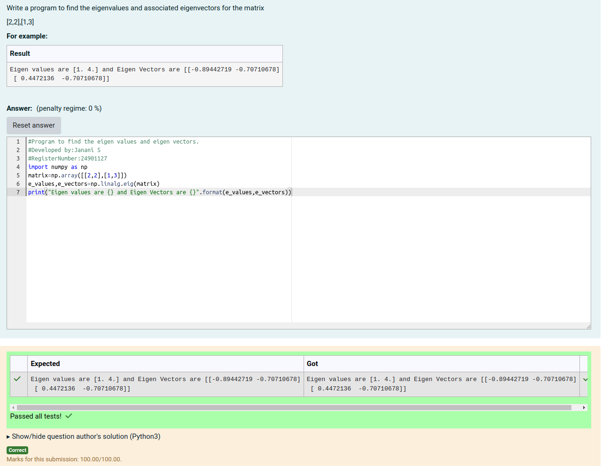

# EIGENVALUES-AND-EIGENVECTORS
## Aim:
To write a python program to find the Eigenvalues and Eigen Vectors
## Equipment’s required:
1. 	Hardware – PCs
2. 	Anaconda – Python 3.7 Installation / Moodle-Code Runner
## Algorithm:
### Step 1:Import the numpy module to use the build-in functions for calculation
### Step 2:Get the matrix form from user using np.array()
### Step 3:Using the np.linalg.eig(),  we get two results (first is eigenvalue and second is eigenvector) of the given matrix.
### Step 4:End of the program

## Program:
```
Program to find the eigen values and eigen vectors.
#Developed by:Janani S 
#RegisterNumber:24901127
import numpy as np
matrix=np.array([[2,2],[1,3]])
e_values,e_vectors=np.linalg.eig(matrix)
print("Eigen values are {} and Eigen Vectors are {}".format(e_values,e_vectors))
```
## Output:

## Result:
Thus the Eigenvalue and Eigenvector is successfully solved using python program
